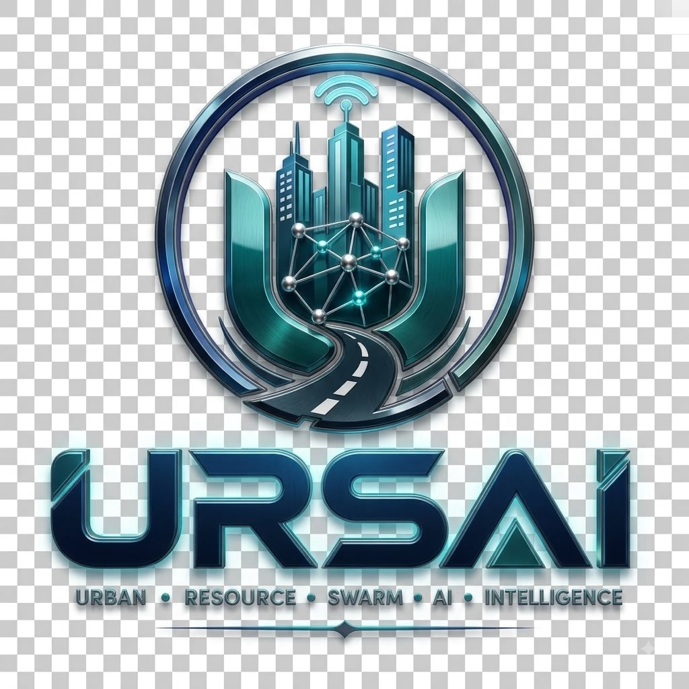
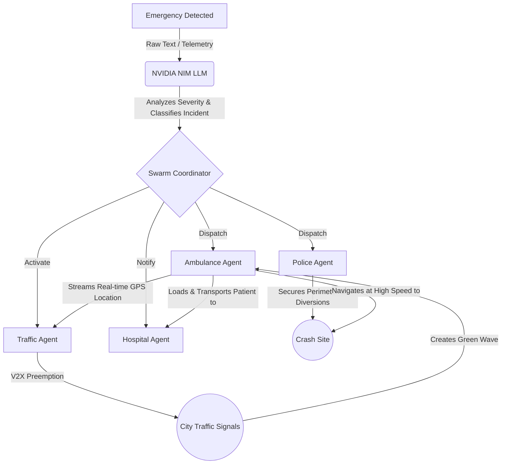

<div align="center">
  
  
  *The URSAI identity: A modern, enterprise-ready symbol representing autonomous urban resource swarm intelligence.*

  # URSAI

  **URBAN RESOURCE SWARM AI INTELLIGENCE.**

  Enterprise grade smart city command. No human latency. Just autonomous swarm logic.

  🎬 [Watch URSAI AI in action — Full Tactical Map Demo](https://drive.google.com/drive/folders/18dUl6W1lwACDIuqiNb_m9BF8IZDsyly6)
</div>

---

## 📊 PROJECT STATISTICS

*Codebase statistics are calculated from project-owned source files at the time of documentation generation. Dependency directories, build artifacts, caches, generated files, binaries, and README documentation are excluded from the primary source LOC calculation.*

```text
+-------------------------------------------------------------------------+
| 📄 SOURCE      | 💻 CODE         | 🧩 MODULES     | 🚀 PERFORMANCE    |
|----------------|-----------------|----------------|-------------------|
| 123 FILES      | 18,539 LINES    | 4 MODULES      | 60 FPS WebGL      |
+-------------------------------------------------------------------------+
```

| Metric | Lines |
| :--- | :--- |
| **Total Lines** | 18,539 |
| **Code Lines** | 15,759 |
| **Blank Lines** | 2,780 |

**Module Breakdown:**

| Module | Files | Lines of Code | Primary Role |
| :--- | :--- | :--- | :--- |
| **Frontend UI** | 35 | 5,600 | React SPA / Command Dashboard |
| **Map Engine** | 6 | 4,300 | Three.js / WebGL 3D Tactical Map |
| **AI Swarm Core** | 16 | 1,460 | Multi-Agent Coordination / Logic |
| **Simulation** | 66 | 7,179 | Data models / City Environment |

---

## 📚 CONTENTS

- [Project Statistics](#-project-statistics)
- [Overview & Philosophy](#-overview--philosophy)
- [Project Scenario: The Chennai Simulation](#-project-scenario-the-chennai-simulation)
- [Problem & Solution](#-problem---solution)
- [Key Features](#-key-features)
- [COMPLETE VISUAL PRODUCT WALKTHROUGH](#-complete-visual-product-walkthrough)
- [System Architecture Flow](#-system-architecture-flow)
- [Module Architecture](#-module-architecture)
- [Languages & Technology Stack](#-languages--technology-stack)
- [Configuration & Setup](#-configuration---setup)

---

## 🎯 OVERVIEW & PHILOSOPHY

**URSAI** stands for **Urban Resource Swarm AI Intelligence**. 

It is a next-generation smart city emergency command and control platform that wraps an entire metropolitan grid in an autonomous AI agent swarm and a highly immersive 3D Digital Twin environment.

### The URSAI Philosophy
The acronym encapsulates the core architecture of the platform:
- **Urban Resource**: Managing and directing critical city infrastructure, such as ambulances, police interceptors, and dynamic traffic grids.
- **Swarm AI Intelligence**: Moving away from centralized human dispatchers and instead utilizing decentralized, multi-agent artificial intelligence. Individual AI agents operate independently but collaborate dynamically as a "swarm" to solve complex logistical problems in real-time.

By integrating multi-agent coordination with **NVIDIA NIM LLMs** for strategic decision-making, URSAI demonstrates how future cities can handle critical incidents—from traffic accidents to severe weather emergencies—entirely autonomously with zero human latency.

---

## 🏙️ PROJECT SCENARIO: THE CHENNAI SIMULATION

To prove the efficacy of the swarm, URSAI features a live **Chennai Command Sector** simulation. The project drops the user into a high-stakes, 3D interactive simulation of downtown Chennai, India. 

**The Use Case:**
A severe, multi-vehicle collision occurs at a major intersection (e.g., Anna Salai / Teynampet DMS Junction Corridor). Human dispatchers would typically take minutes to parse the chaos, contact emergency units, and navigate traffic. URSAI handles it in milliseconds:

1. **Incident Detected**: The Swarm Orchestrator parses the severity of the crash and establishes a V2X (Vehicle-to-Everything) Mesh Network.
2. **Police Interceptor (PD-28)**: Dispatched ahead of medical teams to secure a 150m crash perimeter and establish civilian diversions.
3. **Ambulance Agent (AM-15)**: A Type-IV Advanced Life Support unit is routed to the scene, streaming live ECG telemetry. 
4. **Traffic Controller (TR-07)**: Hijacks the SCATS traffic signal grid. As the ambulance moves, the AI forcibly overrides traffic lights, creating a "Green Wave" corridor that eliminates red-light stops entirely.
5. **Hospital Agent**: Pre-allocates Trauma Bay #2 at Apollo Hospitals (Greams Road) before the patient even arrives.

---

## ❗ PROBLEM → 💡 SOLUTION

```text
           PROBLEM
+---------------------------+
| Human dispatch latency    |
| Fragmented city systems   |
| Traffic gridlock delays   |
| Suboptimal unit routing   |
+---------------------------+
             |
             v
           SOLUTION
+---------------------------+
| Autonomous Agent Swarms   |
| V2X Green Wave Corridors  |
| 3D Digital Command        |
| Sub-second AI Dispatch    |
+---------------------------+
```

---

## ✨ KEY FEATURES

*   **🧠 AI Decision Engine (NVIDIA NIM)**: Utilizes `meta/llama-3.3-70b-instruct` to instantly analyze incident reports, assess severity, and autonomously dispatch the optimal mix of emergency services.
*   **🗺️ 3D Digital Twin Interface**: A fully interactive, high-density WebGL tactical map built on Three.js, featuring real-time tracking of AI agents, live traffic simulation, and dynamic routing.
*   **🤖 Multi-Agent Swarm Logic**: Independent, cooperative agents for Ambulance, Police, Fire Rescue, and Traffic Control. Agents communicate via a central event bus to synchronize complex operations.
*   **🚥 V2X Green Wave Corridors**: The Traffic Agent dynamically preempts SCATS traffic signals, creating zero-stop corridors for emergency vehicles.
*   **📊 Operational Intelligence**: Live telemetry dashboards providing command-center visibility into system health, response times, active dispatches, and hospital availability.
*   **📱 Responsive Command Dashboard**: A meticulously crafted, responsive UI that allows commanders to monitor the swarm from desktop, tablet, or mobile.

---

---

## 🏗️ SYSTEM ARCHITECTURE FLOW

URSAI operates on a decentralized swarm architecture. Instead of a single monolithic brain dictating all moves, URSAI utilizes a **Coordinator** that delegates objectives to specialized, autonomous agents.



1. **Incident Injection**: A simulated multi-vehicle collision is fed to the swarm.
2. **LLM Evaluation**: NVIDIA NIM processes the text, extracts severity, and determines the required agent payload.
3. **Swarm Execution**: The Coordinator wakes up the respective agents.
4. **Agent Collaboration**: The Traffic Agent observes the Ambulance Agent's location in real-time and actively turns traffic lights green ahead of it.
5. **3D Visualization**: The React frontend subscribes to the Agent Event Bus and updates the Three.js canvas at 60 FPS.

---

## 🧩 MODULE ARCHITECTURE

```text
src/
├── agents/            # Autonomous Swarm Agents (Ambulance, Police, Traffic)
├── components/        # React UI Components
│   ├── ai/            # Decision Engine Interfaces
│   ├── map/           # Three.js Tactical 3D Map
│   └── mission/       # Agent Telemetry Sidebars
├── coordination/      # Central Event Bus & Mission Coordinator
├── data/              # City infrastructure datasets & coordinates
├── services/          # Core business logic & API integrations
└── types/             # TypeScript interfaces
```

---

## 💻 LANGUAGES & TECHNOLOGY STACK

URSAI is built for maximum performance, utilizing a modern, strictly-typed web stack to handle intensive rendering and high-frequency telemetry.

*   **TypeScript (85%)**: The core backbone of the URSAI engine. Chosen for its strict type safety, which is absolutely critical when handling concurrent agent states, complex event-bus payloads, and 3D coordinate math without runtime errors.
*   **React 18**: Powers the reactive data layer and UI rendering. The component tree is heavily optimized to prevent unnecessary re-renders when the high-frequency telemetry streams push updates.
*   **Three.js (WebGL)**: The engine driving the 3D Digital Twin. It utilizes advanced PBR (Physically Based Rendering) materials, dynamic shadows, and thousands of instanced geometries to render the cityscape at 60 FPS directly in the browser.
*   **Tailwind CSS**: The utility-first styling framework used to design the cyberpunk, data-dense command center dashboard and ensure it remains responsive across all devices.
*   **Vite**: The lightning-fast build tool and development server powering the project.
*   **NVIDIA NIM Cloud APIs**: Provides low-latency access to the `meta/llama-3.3-70b-instruct` model, which acts as the intelligent brain parsing unstructured emergencies into structured swarm actions.

---

## 🚀 CONFIGURATION & SETUP

### Prerequisites
*   Node.js (v18 or higher)
*   NVIDIA NIM API Key (Required for the AI Decision Engine)

### Local Installation

1. **Clone the repository**
   ```bash
   git clone https://github.com/GLITCHGLORY-7/URSAI.git
   cd URSAI
   ```

2. **Install dependencies**
   ```bash
   npm install
   ```

3. **Configure Environment Variables**
   Create a `.env` file in the root directory:
   ```env
   NVIDIA_API_KEY=your_nvidia_api_key_here
   ```

4. **Start the Development Server**
   ```bash
   npm run dev
   ```
   The application will be available at `http://localhost:5173`.

---

## 🚢 DEPLOYMENT (Vercel)

URSAI is fully optimized for zero-config deployment on Vercel.

1. Import your GitHub repository into Vercel.
2. Vercel will automatically detect the **Vite** configuration.
3. Add your `NVIDIA_API_KEY` to the Vercel Environment Variables.
4. Click **Deploy**.

---

<div align="center">
  <p>Engineered for the future of urban resilience.</p>
</div>
