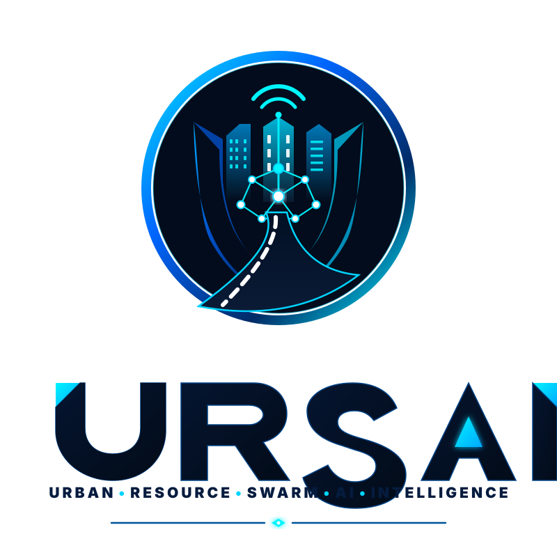

<div align="center">
  
  <h1>URSAI</h1>
  <p><strong>Urban Response Swarm AI - Smart City Emergency Command Center</strong></p>

  <p>
    
    
    
    
    
  </p>
</div>

---

## 🌍 Overview

**URSAI (Urban Response Swarm AI)** is a next-generation smart city emergency command and control platform. It leverages autonomous AI agent swarms and a highly immersive 3D Digital Twin environment to simulate, coordinate, and optimize emergency response logistics across a metropolitan grid.

By integrating multi-agent coordination with **NVIDIA NIM LLMs** for strategic decision-making, URSAI demonstrates how future cities can handle critical incidents—from traffic accidents to severe weather emergencies—with zero human latency.

---

## ✨ Core Features

*   **🧠 AI Decision Engine (NVIDIA NIM)**: Utilizes `Llama-3.3-70b-instruct` to instantly analyze incident reports, assess severity, and autonomously dispatch the optimal mix of emergency services.
*   **🗺️ 3D Digital Twin Interface**: A fully interactive, high-density WebGL tactical map built on Three.js, featuring real-time tracking of AI agents, live traffic simulation, and dynamic routing.
*   **🤖 Multi-Agent Swarm Logic**: Independent, cooperative agents for Ambulance, Police, Fire Rescue, and Traffic Control. Agents communicate via a central event bus to synchronize complex operations (e.g., Police establishing "Green Corridors" for Ambulances).
*   **🛣️ Dynamic Pathfinding**: Calculates optimal routes through the simulated city grid in real-time, responding dynamically to traffic bottlenecks and active incidents.
*   **📊 Operational Intelligence**: Live telemetry dashboards providing command-center visibility into system health, response times, active dispatches, and hospital availability.

---

## 🛠️ Technology Stack

*   **Frontend Framework**: React 18 with TypeScript
*   **3D Rendering**: Three.js (WebGL)
*   **Styling**: Tailwind CSS & Lucide Icons
*   **Build Tool**: Vite
*   **AI Integration**: NVIDIA NIM Cloud APIs (Llama 3.3)
*   **State Management**: React Context API & Event Bus architecture

---

## 🚀 Getting Started

### Prerequisites
*   Node.js (v18 or higher)
*   NVIDIA NIM API Key (Required for the AI Decision Engine)

### Installation

1. **Clone the repository**
   ```bash
   git clone https://github.com/GLITCHGLORY-7/URSAI.git
   cd URSAI
   ```

2. **Install dependencies**
   ```bash
   npm install
   ```

3. **Configure Environment Variables**
   Create a `.env` file in the root directory:
   ```env
   NVIDIA_API_KEY=your_nvidia_api_key_here
   ```

4. **Start the Development Server**
   ```bash
   npm run dev
   ```
   The application will be available at `http://localhost:5173`.

---

## 🚢 Deployment (Vercel)

URSAI is fully optimized for single-click deployment on Vercel.

1. Import your GitHub repository into Vercel.
2. Vercel will automatically detect the **Vite** configuration.
3. Add your `NVIDIA_API_KEY` to the Vercel Environment Variables.
4. Click **Deploy**.

---

## 📂 Project Architecture

```text
src/
├── agents/            # Autonomous Swarm Agents (Police, Fire, EMS)
├── components/        # React UI Components
│   ├── ai/            # Decision Engine Interfaces
│   ├── map/           # Three.js Tactical 3D Map
│   └── ...
├── coordination/      # Central Event Bus & Mission Coordinator
├── data/              # City infrastructure datasets & coordinates
├── services/          # Core business logic & API integrations
└── types/             # TypeScript interfaces
```

---

<div align="center">
  <p>Engineered for the future of urban resilience.</p>
</div>
